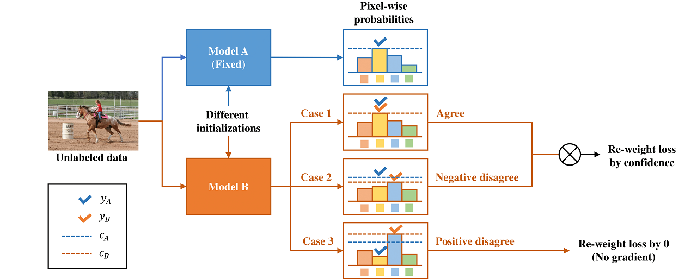

[](https://paperswithcode.com/sota/semi-supervised-semantic-segmentation-on-10?p=semi-supervised-semantic-segmentation-via)
  
[](https://paperswithcode.com/sota/semi-supervised-semantic-segmentation-on-7?p=semi-supervised-semantic-segmentation-via)

[](https://paperswithcode.com/sota/semi-supervised-semantic-segmentation-on-3?p=semi-supervised-semantic-segmentation-via)

[](https://paperswithcode.com/sota/semi-supervised-image-classification-on-cifar?p=semi-supervised-semantic-segmentation-via)

# DMT: Dynamic Mutual Training for Semi-Supervised Learning

This repository contains the code for our paper [DMT: Dynamic Mutual Training for Semi-Supervised Learning](https://arxiv.org/abs/2004.08514), a concise and effective method for semi-supervised semantic segmentation & image classification.

Some might know it as the previous version **DST-CBC**, or *Semi-Supervised Semantic Segmentation via Dynamic Self-Training and Class-Balanced Curriculum*, if you want the old code, you can check out the [dst-cbc](https://github.com/voldemortX/DST-CBC/tree/dst-cbc) branch.

Also, for older PyTorch version (<1.6.0) users, or the **exact** same environment that produced the paper's results, refer to [53853f6](https://github.com/voldemortX/DST-CBC/tree/53853f63033fdb88206828a72d960de2c03efd69).

<div align="center">
  
</div>

## News

### 2022.6.16

The arxiv version is in long single column format. The Pattern Recognition website has the [double-column version](https://www.sciencedirect.com/science/article/abs/pii/S0031320322002588), with the same content.

### 2022.5.5

After a 17-months review (that is excluding prior rejections at ECCV 20, AAAI 21), DMT is finally **accepted** at Pattern Recognition. Cheers! The arxiv version will soon be updated, once we have the final publish format.

### 2021.6.7

**Multi-GPU** training support (based on [Accelerate](https://github.com/huggingface/accelerate)) is added, and the whole project is upgraded to PyTorch 1.6.
Thanks to the codes & testing by [**@jinhuan-hit**](https://github.com/jinhuan-hit), and discussions from [**@lorenmt**](https://github.com/lorenmt), [**@TiankaiHang**](https://github.com/TiankaiHang).

### 2021.2.10

A slight backbone architecture difference in the segmentation task has just been identified and described in Acknowledgement.

### 2021.1.1

DMT is released. Happy new year! :wink: 

### 2020.12.7

The bug fix for DST-CBC (not fully tested) is released at the [scale](https://github.com/voldemortX/DST-CBC/tree/scale) branch.

### 2020.11.9

~~Stay tuned for Dynamic Mutual Training (DMT), an updated version of DST-CBC, which has overall better and stabler performance and will be released early November.~~
**A new version Dynamic Mutual Training (DMT) will be released later, which has overall better and stabler performance.**

Also, thanks to [**@lorenmt**](https://github.com/lorenmt), a data augmentation bug fix will be released along with the next version, where PASCAL VOC performance is overall boosted by 1~2%, Cityscapes could also have better performance. But probably the gap to oracle will remain similar.

## Setup

First, you'll need a CUDA 10, Python3 environment (best on Linux).

### 1. Setup PyTorch & TorchVision:

```
pip install torch==1.6.0 torchvision==0.7.0
```

### 2. Install other python packages you may require:

```
pip install packaging accelerate future matplotlib tensorboard tqdm
pip install git+https://github.com/ildoonet/pytorch-randaugment
```

### 3. Download the code and prepare the scripts:

```
git clone https://github.com/voldemortX/DST-CBC.git
cd DST-CBC
chmod 777 segmentation/*.sh
chmod 777 classification/*.sh
```

## Getting started

Get started with [SEGMENTATION.md](SEGMENTATION.md) for semantic segmentation.

Get started with [CLASSIFICATION.md](CLASSIFICATION.md) for image classification.

## Understand the code

We refer interested readers to this repository's [wiki](https://github.com/voldemortX/DST-CBC/wiki). *It is not updated for DMT yet.*

## Notes

It's best to use a **Turing** or **Volta** architecture GPU when running our code, since they have tensor cores and the computation speed is much faster with mixed precision. For instance, RTX 2080 Ti (which is what we used) or Tesla V100, RTX 20/30 series.

Our implementation is fast and memory efficient. A whole run (train 2 models by DMT on PASCAL VOC 2012) takes about 8 hours on a single RTX 2080 Ti using up to 6GB graphic memory, including on-the-fly evaluations and training baselines. The Cityscapes experiments are even faster.

## Contact

Issues and PRs are most welcomed. 

If you have any questions that are not answerable with Google, feel free to contact us through zyfeng97@outlook.com.

## Citation

```
@article{feng2022dmt,
  title={DMT: Dynamic Mutual Training for Semi-Supervised Learning},
  author={Feng, Zhengyang and Zhou, Qianyu and Gu, Qiqi and Tan, Xin and Cheng, Guangliang and Lu, Xuequan and Shi, Jianping and Ma, Lizhuang},
  journal={Pattern Recognition},
  year={2022},
  volume={130},
  pages={108777},
  doi={10.1016/j.patcog.2022.108777}
}
```

## Acknowledgements

The DeepLabV2 network architecture and coco pre-trained weights are faithfully re-implemented from [AdvSemiSeg](https://github.com/hfslyc/AdvSemiSeg). The only difference is we use the so-called ResNetV1.5 implementation for ResNet-101 backbone (same as torchvision), for difference between ResNetV1 and V1.5, refer to [this issue](https://github.com/pytorch/vision/issues/191). However, the difference is reported to only bring 0-0.5% gain in ImageNet, considering we use the V1 COCO pre-trained weights that mismatch with V1.5, the overall performance should remain similar to V1. The better fully-supervised performance mainly comes from better training schedule. Besides, we base comparisons on relative performance to Oracle, not absolute performance.

The CBC part of the older version DST-CBC is adapted from [CRST](https://github.com/yzou2/CRST).

The overall implementation is based on [TorchVision](https://github.com/pytorch/vision) and [PyTorch](https://github.com/pytorch/pytorch).

The people who've helped to make the method & code better: [**lorenmt**](https://github.com/lorenmt), [**jinhuan-hit**](https://github.com/jinhuan-hit), [**TiankaiHang**](https://github.com/TiankaiHang), etc.
